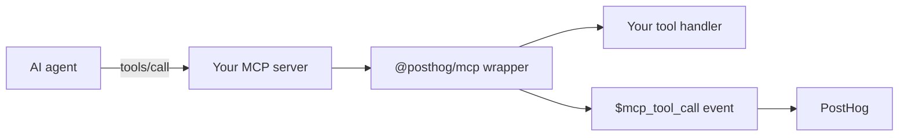

import CalloutBox from 'components/Docs/CalloutBox'
import OSButton from 'components/OSButton'

<CalloutBox icon="IconFlask" title="MCP Analytics is in beta" type="action">

`@posthog/mcp` is a TypeScript SDK for instrumenting Model Context Protocol (MCP) servers with PostHog analytics. It's published on npm as a `0.1.x` release while we build it in public. The API, event names, properties, and tracing behavior may change before the SDK reaches `1.0`. Don't depend on it for production reporting yet. Today, only TypeScript MCP servers are supported – a Python SDK is on the roadmap.

</CalloutBox>

MCP Analytics helps you understand how AI agents actually use the MCP server you ship: which tools get called, how often, what intent the agent had, where calls are failing, what tools the agent asked for but you don't offer yet, and how individual sessions flow end to end.

The SDK wraps your existing MCP server and emits PostHog events on every tool call, resource read, prompt fetch, and initialize handshake. You can keep using whatever tooling you already have on top of PostHog – insights, dashboards, alerts, Error Tracking – without any additional ingestion plumbing.

<CalloutBox icon="IconFlask" title="A dedicated MCP Analytics view is in preview" type="action">

PostHog has a purpose-built **MCP Analytics** view – a dashboard, a sessions explorer, per-tool quality breakdowns, and intent clustering, all built on the `$mcp_*` events the SDK sends. It's in preview behind a feature flag while we build it in public. Because every signal is a normal PostHog event, you don't have to wait for it: you can query and visualize the same data today through [Product Analytics](/docs/product-analytics) for trends and funnels, the [SQL editor](/docs/data-warehouse/sql) for ad-hoc HogQL, [Dashboards](/docs/product-analytics/dashboards) for at-a-glance views, and [Error Tracking](/docs/error-tracking) for `$exception` events. The events on this page won't change shape as the view matures.

</CalloutBox>

<OSButton variant="primary" asLink to="/docs/mcp-analytics/start-here">
Get started
</OSButton>

## What you can answer

- Which tools is each MCP client calling, and how often?
- What is the agent actually trying to do (`$mcp_intent`)?
- Which tools are advertised in `tools/list` responses but never get called?
- What's the error rate and p95 latency of a given tool?
- Did an agent hit `get_more_tools` because the right capability didn't exist?
- How does a single MCP session unfold across tool calls?

The MCP Analytics dashboard answers most of these at a glance – tool call volume, error rate, p95 latency, and the share of traffic per client:

<ProductScreenshot
  imageLight="https://res.cloudinary.com/dmukukwp6/image/upload/q_auto,f_auto/mcp_dashboard_light_0907967b56.png"
  imageDark="https://res.cloudinary.com/dmukukwp6/image/upload/q_auto,f_auto/mcp_dashboard_dark_5023c584d4.png"
  alt="MCP Analytics dashboard showing sessions, tool calls, error rate, p95 latency, daily activity, and share of calls by client"
  classes="rounded"
/>

Drill into any single MCP session to step through its tool calls, intents, and errors in order:

<ProductScreenshot
  imageLight="https://res.cloudinary.com/dmukukwp6/image/upload/q_auto,f_auto/mcp_sessions_light_bdd1eb84cb.png"
  imageDark="https://res.cloudinary.com/dmukukwp6/image/upload/q_auto,f_auto/mcp_sessions_dark_d5b4aa4577.png"
  alt="MCP Analytics sessions explorer showing a session's tool calls, intents, and an errored call"
  classes="rounded"
/>

## How it works

`instrument(server, posthog, options?)` patches your MCP server's request handlers and returns an analytics handle. The `posthog` client (a [`posthog-node`](/docs/libraries/node) instance) is a required positional argument. When the agent calls a tool, the SDK:

1. Builds a structured event with the tool name, parameters, response, duration, and error state.
2. Runs the payload through sanitization (image/audio/binary stubs, sensitive-key masking), truncation, and your optional `beforeSend` hook.
3. Sends it to PostHog via the `posthog-node` client you pass in, batched and flushed by that client.

Your tool handlers are untouched. The only payload change the agent sees is an optional injected `context` argument (see [Capturing agent intent](/docs/mcp-analytics/intent)) and an optional injected `conversation_id` argument (see [Conversation IDs](/docs/mcp-analytics/conversation-id)).



## Quick install

```bash
npm install @posthog/mcp posthog-node
```

```ts
import { Server } from "@modelcontextprotocol/sdk/server/index.js"
import { PostHog } from "posthog-node"
import { instrument } from "@posthog/mcp"

const server = new Server({ name: "my-mcp-server", version: "1.0.0" })

const posthog = new PostHog(process.env.POSTHOG_PROJECT_API_KEY, {
  host: "https://us.i.posthog.com",
})

instrument(server, posthog)
```

That's the minimum. With this in place, every `tools/call`, `tools/list`, `initialize`, `resources/read`, and `prompts/get` request emits a PostHog event prefixed with `$mcp_*`.

<OSButton variant="primary" asLink to="/docs/mcp-analytics/installation">
Full installation guide
</OSButton>

## Where to go next

- **[Getting started](/docs/mcp-analytics/start-here)** – the guided onboarding flow
- **[Installation](/docs/mcp-analytics/installation)** – full setup, server type variants, BYO PostHog client
- **[Custom servers](/docs/mcp-analytics/custom-servers)** – `PostHogMCP` for Hono/edge dispatchers with no server object to wrap
- **[Capturing agent intent](/docs/mcp-analytics/intent)** – the `context` argument and `intentFallback`
- **[Conversation IDs](/docs/mcp-analytics/conversation-id)** – stitching multi-turn conversations together
- **[Identifying users](/docs/mcp-analytics/identifying-users)** – attaching events to your own users
- **[Missing capability tracking](/docs/mcp-analytics/missing-capability)** – the `get_more_tools` virtual tool
- **[Custom events and metadata](/docs/mcp-analytics/custom-events)** – `analytics.capture()` and `eventProperties`
- **[Privacy and redaction](/docs/mcp-analytics/privacy)** – what's sanitized automatically, customer redaction hook
- **[Event and property reference](/docs/mcp-analytics/events)** – every event the SDK emits and what's on it
- **[Sample queries](/docs/mcp-analytics/queries)** – HogQL recipes for the most common dashboards

## Building in public

The SDK source lives in the [`posthog-js` monorepo](https://github.com/PostHog/posthog-js/tree/main/packages/mcp) alongside the rest of PostHog's JavaScript and TypeScript SDKs. Issues, PRs, and feedback are welcome. We started from a duplicated copy of the MIT-licensed [MCPcat TypeScript SDK](https://github.com/MCPCat/mcpcat-typescript-sdk) – the event schema, identity model, and feature surface have since diverged.
