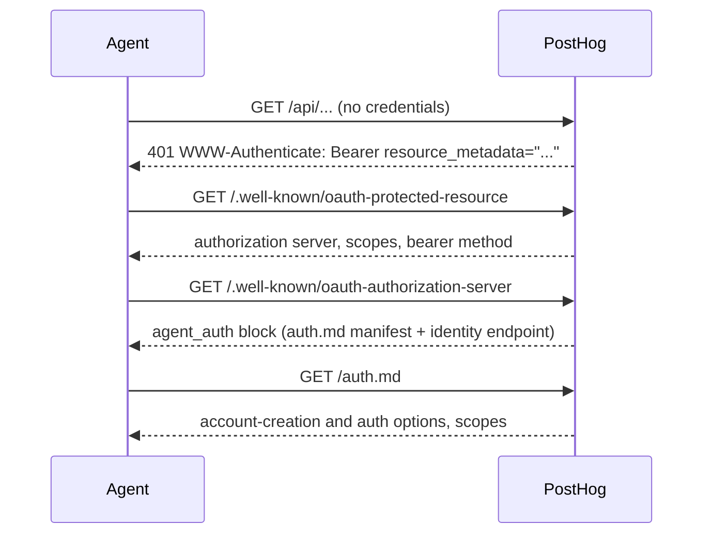

PostHog publishes machine-readable metadata so AI agents can discover how to authenticate and create accounts, with no PostHog-specific SDK and no hardcoded endpoints. An agent starts from a single unauthenticated API request and follows a standard discovery chain to find the available options.

This page covers discovery. For the flows themselves, see:

- [AI wizard](/docs/ai-engineering/ai-wizard) to create an account from the command line
- [OAuth](/docs/api/oauth) and [personal API keys](/docs/api#authentication) for an existing user
- [Provisioning API](/docs/integrate/provisioning) for partners creating accounts for their users
- [ID-JAG (XAA)](/docs/settings/id-jag) for agent registration via identity assertion (Enterprise plan, beta)

## How discovery works

An agent does not need to be told where PostHog's endpoints are. It finds them by following the metadata chain, starting from one unauthenticated request to the API.

```
1. Call the PostHog API with no credentials
   →  401 with WWW-Authenticate: Bearer resource_metadata="…/.well-known/oauth-protected-resource"

2. Read the protected resource metadata (RFC 9728)
   →  the authorization server, supported scopes, and bearer method

3. Read the authorization server metadata (RFC 8414)
   →  the agent_auth block names the auth.md manifest and the identity endpoint

4. Read the auth.md manifest at /auth.md
   →  the available ways to create an account and authenticate, plus the scope inventory
```



### Protected resource metadata

A request to the PostHog API without credentials returns `401` with a `WWW-Authenticate` header pointing at the protected resource metadata document ([RFC 9728](https://datatracker.ietf.org/doc/rfc9728/)):

```
WWW-Authenticate: Bearer resource_metadata="https://us.posthog.com/.well-known/oauth-protected-resource"
```

That document names the authorization server, the supported scopes, and the bearer method:

```json
{
  "resource": "https://us.posthog.com",
  "authorization_servers": ["https://us.posthog.com"],
  "scopes_supported": ["query:read", "insight:read", "feature_flag:read", "..."],
  "bearer_methods_supported": ["header"]
}
```

### Authorization server metadata

The authorization server metadata ([RFC 8414](https://datatracker.ietf.org/doc/rfc8414/)) carries the standard OAuth endpoints plus an `agent_auth` block that follows the [auth.md](https://workos.com/auth-md) profile:

```json
{
  "issuer": "https://us.posthog.com",
  "agent_auth": {
    "skill": "https://us.posthog.com/auth.md",
    "identity_endpoint": "https://us.posthog.com/oauth/token/",
    "identity_types_supported": ["identity_assertion"],
    "identity_assertion": {
      "assertion_types_supported": ["urn:ietf:params:oauth:token-type:id-jag"]
    }
  }
}
```

- `skill` points at the auth.md manifest.
- `identity_endpoint` is the token endpoint where an agent exchanges an identity assertion for an access token. PostHog accepts the [ID-JAG](/docs/settings/id-jag) assertion type via the JWT-bearer grant. See the [ID-JAG docs](/docs/settings/id-jag) for the exchange itself.

### The auth.md manifest

The manifest at [`/auth.md`](https://us.posthog.com/auth.md) lists the available ways to create an account (wizard, provisioning API) and authenticate (OAuth, personal API keys, ID-JAG), with the scope inventory, in a format an agent can read. It is the agent-readable index of everything above.

## Regions

PostHog's US and EU regions each serve their own metadata, manifest, and endpoints, pinned per region. Because discovery starts from a single `401` on the API, an agent that follows the chain picks up the right region's URLs without hardcoding any of them.

| | US | EU |
|---|---|---|
| Protected resource metadata | `https://us.posthog.com/.well-known/oauth-protected-resource` | `https://eu.posthog.com/.well-known/oauth-protected-resource` |
| Authorization server metadata | `https://us.posthog.com/.well-known/oauth-authorization-server` | `https://eu.posthog.com/.well-known/oauth-authorization-server` |
| auth.md manifest | `https://us.posthog.com/auth.md` | `https://eu.posthog.com/auth.md` |
